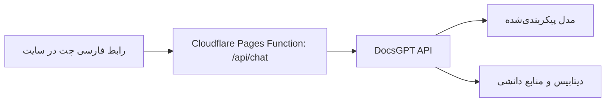

# اتصال DocsGPT به سایت زی‌تک

وضعیت: رابط و اتصال سروری پیاده‌سازی شده‌اند؛ فعال‌سازی و آزمون زنده منتظر
انتشار Agent و تنظیم کلیدهاست. هیچ استقرار خارجی انجام نشده است.
تاریخ بررسی: ۲۰۲۶-۱۰-۰۸. مسیر انتخاب‌شده: DocsGPT Cloud.
اولویت کاربر: شروع رایگان، بدون VPS موجود؛ خرید VPS در صورت نیاز پذیرفته است.
میزبانی بک‌اند خارج از Cloudflare نیز قابل بررسی است.

حساب و استقرار تأییدشده توسط کاربر: سایت روی Cloudflare Pages با نام
`zitechai` و مخزن `Ankahastam/zitechai`، شاخهٔ `main` مستقر است.
Agent در پنل DocsGPT پاسخ می‌دهد و فایل دانش را به‌عنوان منبع نشان می‌دهد.
کاربر تنظیم Turnstile و ذخیرهٔ دو Secret چت در Cloudflare را تأیید کرده است.
این تأیید، آزمون زندهٔ API از سایت یا میزان سهمیهٔ رایگان را اثبات نمی‌کند.

## نتیجهٔ بررسی

می‌توان رابط چت فارسی و RTL را داخل سایت ساخت و از API بک‌اند DocsGPT
استفاده کرد. لازم نیست رابط React/Vite اصلی پروژه وارد سایت Next.js شود.
DocsGPT موتور مدیریت گفتگو، اسناد و بازیابی اطلاعات است؛ مدل تولید پاسخ و
مدل embedding جداگانه پیکربندی می‌شوند.

سایت فعلی در `next.config.ts` از `output: "export"` استفاده می‌کند.
مسیر `functions/api/lead.js` الگوی موجود برای Cloudflare Pages Functions است.
صفحهٔ `/chat` فعلاً صفحهٔ معرفی خدمات است، نه یک رابط گفتگو.
این اتصال به تغییر محتوای تأییدشدهٔ آن صفحه نیاز ندارد.

## مسیر درخواست پیشنهادی



دروازهٔ سروری، کلید یک Agent مشخص را از Secret می‌خواند و درخواست را به
`https://gptcloud.arc53.com/api/answer` می‌فرستد. نسخهٔ اولیه پاسخ کامل را
نمایش می‌دهد و هنگام تولید، وضعیت انتظار دارد. استریم با `/stream` توسعهٔ
بعدی است و در نسخهٔ فعلی پیاده‌سازی نشده است.

رابط اولیه: پنجرهٔ چت فارسی و RTL در گوشهٔ سایت، ارسال پیام، نمایش پاسخ و
منابع، شروع گفتگوی جدید و خطا. کد پنجره با اولین کلیک بارگذاری می‌شود.
بستن پنجره وضعیت گفتگو را حفظ می‌کند؛ تولید پاسخ را لغو نمی‌کند.

کنترل‌های لازم در دروازه: محدودیت اندازه و نرخ درخواست، اعتبارسنجی ورودی،
کنترل سوءاستفاده، کلیدهای صرفاً سروری و اتصال شناسهٔ گفتگو به نشست معتبر
بازدیدکننده. شناسهٔ ارسالی از مرورگر به‌تنهایی مجوز دسترسی به گفتگو نیست.
مدل، اسناد و ابزارهای Agent از تنظیمات سرور تعیین شوند.

کنترل‌های پیاده‌سازی‌شده: ورودی حداکثر ۲۰۰۰ کاراکتر و بدنهٔ حداکثر ۱۲ KB،
تأیید Turnstile با action برابر `website_chat` در هر پیام، کنترل Origin،
انتخاب ثابت Agent و URL سروری، timeout بدون تکرار خودکار، حذف جزئیات خصوصی
پاسخ سرویس و نشست یک‌ساعتهٔ امضاشده با Cookie از نوع HttpOnly/Secure/SameSite.
شناسهٔ گفتگو از Cookie امضاشده خوانده می‌شود؛ شناسهٔ ارسالی در JSON نادیده
گرفته می‌شود. منقضی شدن نشست به شروع گفتگوی تازه نیاز دارد.

درخواست‌ها با `visibility: "hidden"` ارسال می‌شوند؛ گفتگوها ذخیره می‌شوند
ولی فهرست Chats صاحب حساب را پر نمی‌کنند. برای خواندن سؤال‌ها و پاسخ‌های
سایت، تب Logs خود Agent یا Settings → Logs را باز کن.

Turnstile جایگزین سهمیهٔ مصرف یا rate limit نیست. پیش از فعال‌سازی عمومی،
سقف درخواست/توکن Agent و سهمیهٔ حساب را در DocsGPT بررسی و محدود کن.
در صورت نیاز محدودیت IP در Cloudflare نیز اضافه شود؛ چنین محدودیتی در
نسخهٔ فعلی دروازه پیاده‌سازی نشده است.

## تنظیم حساب و فعال‌سازی

1. در DocsGPT Cloud به Knowledge برو و فایل `docs/docsgpt-knowledge.txt` را
   بارگذاری کن؛ تکمیل پردازش آن را بررسی کن. این فایل از محتوای فعلی سایت
   ساخته شده است و با تغییر خدمات باید به‌روز شود.
2. در New Agent نام «دستیار زی‌تک» و توضیح «پاسخ‌گویی فارسی دربارهٔ خدمات
   زی‌تک بر اساس منابع تأییدشده» را وارد کن.
3. Knowledge را به فایل بالا وصل کن. در Prompt → Add متن
   `docs/docsgpt-agent-prompt.txt` را اضافه و انتخاب کن. Tools را خالی بگذار.
4. در بخش Model مدلی را انتخاب کن که حساب رایگانت بدون کارت اجازهٔ استفاده
   از آن را می‌دهد. مدل یا سهمیهٔ رایگان حساب هنوز تأیید نشده است.
5. Publish و سپس More actions → Access Details را باز کن. کلید Agent را
   مستقیماً در Cloudflare ذخیره کن؛ آن را داخل چت، کد یا Git قرار نده.
6. در تنظیمات پروژهٔ Cloudflare **Pages**، در Variables and Secrets:
   `DOCSGPT_API_KEY` و `CHAT_SESSION_SECRET` را Secret قرار بده.
   دومی یک مقدار تصادفی مستقل حداقل ۳۲ کاراکتری است.
   `TURNSTILE_SECRET_KEY` نیز باید موجود باشد.
7. متغیرهای زمان build: `NEXT_PUBLIC_TURNSTILE_SITE_KEY` کلید عمومی Turnstile
   و `NEXT_PUBLIC_CHAT_ENABLED=true` برای نمایش رابط. پس از تغییر، build
   جدید لازم است. تا زمان تأیید اتصال، مقدار نمایش را `false` نگه دار.
8. ابتدا در Preview با دامنهٔ مجاز Turnstile فعال کن. سؤال فارسی بپرس، یک
   سؤال پیگیری بفرست و در مرورگر/نشست دیگری جداسازی گفتگوها را بررسی کن.
   سپس حساب و سهمیهٔ مصرف را بررسی کن و نسخهٔ تولید را فعال کن.

ساخت Secret تصادفی در PowerShell با Node (خروجی را مستقیم در Cloudflare
قرار بده، نه در Git):

```powershell
node -e "console.log(require('node:crypto').randomBytes(32).toString('base64url'))"
```

این اتصال از **Pages Functions** پوشهٔ `functions/` استفاده می‌کند؛ استقرار
صرفاً assets با `wrangler deploy` این API را نمی‌سازد. برای پروژهٔ Pages خروجی
build همان `out` است. برای اجرای دستی با Wrangler از ریشهٔ ریپو:

```powershell
npm.cmd run build
npx.cmd wrangler pages deploy out --project-name zitechai
```

مسیر فعلی انتشار، اتصال GitHub پروژهٔ Pages است: متغیر معمولی
`NEXT_PUBLIC_CHAT_ENABLED=true` را در Production تنظیم کن؛ سپس commit جدید
کد چت روی `main` باعث build خودکار می‌شود. اگر متغیر بعد از شروع build تغییر
کرد، از پنل Deployments همان commit جدید را دوباره deploy کن. اجرای مجدد
commit قدیمی کد چت را به سایت اضافه نمی‌کند.

تنظیمات حساب در پنل Pages باقی می‌مانند. فایل موجود `wrangler.jsonc` برای
Workers assets است و `pages_build_output_dir` ندارد؛ آن را بدون دریافت و
بررسی تنظیمات واقعی Pages به منبع تنظیمات استقرار تبدیل نکن. این تبدیل
می‌تواند متغیرها و bindingهای پنل را تحت تأثیر قرار دهد.

برای تست محلی API، Secretها را در `.dev.vars` قرار بده و از
`npx.cmd wrangler pages dev out` استفاده کن. `next dev` به‌تنهایی Pages
Functions را اجرا نمی‌کند. `.dev.vars` باید خارج از Git بماند.

## بررسی‌های محلی

```powershell
npm.cmd run check:chat
npm.cmd run typecheck
npm.cmd run lint
npm.cmd run build
```

آزمون دروازه با سرویس‌های شبیه‌سازی‌شده انجام می‌شود و اتصال واقعی به حساب
DocsGPT Cloud را اثبات نمی‌کند. سایت دربارهٔ ارسال و ذخیرهٔ پیام‌ها در
DocsGPT Cloud به بازدیدکننده اطلاع می‌دهد.

بررسی رابط در Chrome با API و Turnstile شبیه‌سازی‌شده در عرض‌های ۱۴۴۰، ۳۹۰
و ۳۲۰ پیکسل انجام شد: اندازهٔ پنجره، RTL، فوکوس ورودی، ارسال/پیگیری، بستن
با Escape، حفظ پیام‌ها هنگام بازکردن دوباره، خطای ارسال و گفتگوی تازه.
Turnstile واقعی روی دامنهٔ استقرار هنوز باید آزمایش شود.

## تشخیص خطای چت پس از استقرار

کاربر اجرای GET با پاسخ JSON و وضعیت 405 را روی هر دو دامنه تأیید کرده است.
POST با بدنهٔ خالی نیز روی دامنهٔ اصلی JSON با وضعیت 400 می‌دهد. این نتایج
اجرای Function و وجود تنظیمات ضروری را نشان می‌دهند؛ اعتبار کلیدها یا
موفقیت تماس با Turnstile و DocsGPT را ثابت نمی‌کنند. درخواست واقعی کاربر
صفحهٔ HTML خطای 502 Cloudflare برگردانده و علت آن هنوز تأیید نشده است.

پاسخ‌های نسخهٔ فعلی هدر `X-Zitech-Chat: 3` دارند. هر POST یک شناسهٔ
تصادفی `requestId` دارد که در هدر `X-Zitech-Request-Id`، پاسخ JSON خطا و
لاگ‌های همان درخواست دیده می‌شود. در Functions استقرار فعال، لاگ زنده را
باز نگه دار و یک پیام آزمایشی بفرست. رویدادهای `chat_stage_started` و
`chat_stage_response` تماس با `turnstile` و `docsgpt` را جدا می‌کنند.
خطای خواندن پاسخ در مرحلهٔ `docsgpt_response` ثبت می‌شود. رویداد
`chat_request_failed` نوع ثابت خطا و `chat_upstream_error` فقط وضعیت HTTP
سرویس را ثبت می‌کند. زمان سپری‌شده بر حسب میلی‌ثانیه در `durationMs` است.

لاگ‌ها شامل متن سؤال، پاسخ، توکن Turnstile، کلید، Cookie، IP یا شناسهٔ
گفتگوی DocsGPT نیستند. این تغییر برای تشخیص است و به‌معنای رفع علت 502
نیست. لاگ زندهٔ Pages به‌صورت خودکار تاریخچهٔ پایدار ایجاد نمی‌کند.

لاگ بعدی کاربر نشان داد Turnstile موفق است و تماس DocsGPT فوراً و بدون
دریافت وضعیت HTTP شکست می‌خورد. یک ناسازگاری قطعی در کد پیدا شد:
`redirect: "error"` در Node پذیرفته می‌شود، اما runtime کلادفلر (workerd)
آن را هنگام ساخت درخواست رد می‌کند. مقدار به `manual` تغییر یافت؛ پاسخ
3xx همچنان رد می‌شود و کلید به مقصد redirect فرستاده نمی‌شود. تست‌ها رفتار
workerd و رد پاسخ‌های 301، 302، 303، 307 و 308 را پوشش می‌دهند. موفقیت کامل
پاسخ‌گویی زنده پس از این اصلاح باید در استقرار جدید تأیید شود.

## استقرار

| مسیر | اجزا | نتیجه |
| --- | --- | --- |
| سایت و دروازه روی Cloudflare، بک‌اند روی سرور جدا | Pages و Functions؛ DocsGPT و سرویس‌های داده با Docker روی سرور | پیشنهاد ساده‌تر برای حفظ بک‌اند اصلی؛ میزبانی کامل روی Cloudflare محسوب نمی‌شود. |
| همهٔ سرویس‌های برنامه روی Cloudflare | Pages، Functions، Containers و ذخیره‌سازی پایدار طراحی‌شده | نیازمند نمونهٔ عملی و تطبیق استقرار؛ با نصب معمول سایت انجام نمی‌شود. |

استقرار معمول DocsGPT شامل API پایتون، Celery worker، PostgreSQL، Redis
و ذخیره‌سازی پایدار فایل‌ها و ایندکس‌هاست. اجرای API به‌تنهایی کافی نیست.

Cloudflare Containers روی پلن Workers Paid امکان اجرای محیط Linux و Python
را می‌دهد. دیسک کانتینر به‌صورت پیش‌فرض موقت است؛ طرح صرفاً مبتنی بر ذخیرهٔ
Postgres، Redis و ایندکس‌ها روی همان دیسک، برای تولید مناسب نیست.
Snapshots جایگزین خودکار دوام تراکنش‌های دیتابیس نیستند.

برای مسیر کاملاً Cloudflare باید دوام داده، ارتباط سرویس‌ها، بازیابی پس از
راه‌اندازی مجدد، پردازش صف و هزینهٔ اجرای مستمر اثبات شوند.
R2 برای فایل‌ها قابل بررسی است؛ سازگاری تنظیمات S3 پروژه با آن باید آزمایش
شود. جایگزینی PostgreSQL و Redis با D1 و Queues تغییر معماری بک‌اند است
و با خواستهٔ «فقط تغییر رابط» هم‌ارز نیست.

محل اجرای مدل نیز باید مشخص شود: استفاده از API مدل بیرونی یعنی استنتاج
خارج از Cloudflare انجام می‌شود، حتی اگر همهٔ سرویس‌های برنامه روی آن باشند.

## گزینه‌های شروع رایگان

- **DocsGPT Cloud:** وب‌سایت رسمی شروع رایگان فردی را اعلام می‌کند و مستندات،
  اتصال Agent از طریق API را توضیح می‌دهند. سهمیه، مدت استفادهٔ رایگان و دسترسی
  API روی حساب رایگان از صفحات عمومی بررسی‌شده مشخص نیست؛ برای وعدهٔ اجرای
  رایگان روی سایت باید در حساب واقعی بررسی شوند. این مسیر استفاده از بک‌اند
  میزبانی‌شدهٔ DocsGPT است، نه استقرار ریپو توسط ما.
- **Oracle Always Free:** امکان دریافت VM رایگان وجود دارد؛ سهمیهٔ فعلی A1
  برابر ۲ OCPU و ۱۲ GB RAM است. ظرفیت منطقه تضمین‌شده نیست و VM کم‌مصرف
  ممکن است پس گرفته شود. ثبت‌نام معمولاً به کارت معتبر نیاز دارد. سازگاری
  تصاویر و وابستگی‌های DocsGPT با ARM باید پیش از انتخاب این مسیر بررسی شود.
- **Render Free:** برای دموی محدود قابل بررسی است؛ worker رایگان مستقل ندارد،
  دیسک پایدار رایگان ندارد و دیتابیس رایگان PostgreSQL پس از ۳۰ روز منقضی
  می‌شود. برای استقرار بلندمدت همین مجموعهٔ سرویس‌ها پیشنهاد نمی‌شود.
- **Hugging Face Spaces:** طبق راهنمای فعلی، ساخت Docker Space به پلن پولی
  نیاز دارد، حتی اگر CPU Basic هزینهٔ ساعتی نداشته باشد. این مسیر برای حساب
  جدید یک گزینهٔ کاملاً رایگان محسوب نمی‌شود.

پیشنهاد ترتیب تصمیم: ابتدا بررسی سهمیه و Agent API در حساب DocsGPT Cloud؛
اگر self-hosting لازم است، بررسی امکان دریافت Oracle Always Free؛ در صورت
ناممکن بودن این دو، انتخاب VPS با دادهٔ پایدار. رایگان بودن کد DocsGPT
به‌معنای رایگان بودن منابع سرور یا استنتاج مدل نیست.

برای بررسی Cloud: ورود به `app.docsgpt.cloud`، ساخت Agent با اسناد مجاز،
Publish و بررسی Access Details و محدودیت مصرف حساب. کلید Agent باید در Secret
سروری Cloudflare تنظیم شود. دسترسی حساب، کلیدها و سهمیه هنوز بررسی نشده‌اند.

## ترتیب اجرا پس از تعیین زیرساخت

1. انتخاب و تثبیت نسخهٔ DocsGPT، مدل، embedding و اسناد مجاز Agent.
2. اجرای بک‌اند و بررسی ورود سند، بازیابی، پاسخ فارسی و حفظ گفتگو.
3. ساخت دروازهٔ `/api/chat` و رابط متناسب با طراحی زی‌تک.
4. بررسی پاسخ، جداسازی نشست‌ها، خطا، کیبورد، موبایل و RTL.
5. استقرار آزمایشی و بررسی دوام داده و محدودیت مصرف قبل از تولید.

بررسی فعلی بر اساس فایل‌های محلی سایت و مستندات رسمی است؛ سازگاری عملی
DocsGPT با Containers، حساب Cloudflare و ارتباط زنده با مدل آزمایش نشده است.

## منابع

- [مخزن DocsGPT و مجوز MIT](https://github.com/arc53/DocsGPT)
- [معماری DocsGPT](https://docs.docsgpt.cloud/Concepts/Architecture)
- [Agent API و SSE](https://docs.docsgpt.cloud/API/agent-api)
- [Cloudflare Containers](https://developers.cloudflare.com/containers/)
- [چرخهٔ اجرا و ذخیره‌سازی Containers](https://developers.cloudflare.com/containers/concepts/architecture/)
- [قیمت و شروع رایگان DocsGPT Cloud](https://www.docsgpt.cloud/pricing)
- [کلید Agent](https://docs.docsgpt.cloud/API/agent-keys)
- [گفتگوهای API و visibility](https://docs.docsgpt.cloud/API/agent-api)
- [خواندن گفتگوها و Logs](https://docs.docsgpt.cloud/Using/analytics-and-logs)
- [تنظیمات Pages و Wrangler](https://developers.cloudflare.com/pages/functions/wrangler-configuration/)
- [رفتار redirect در منبع workerd](https://github.com/cloudflare/workerd/blob/main/src/workerd/api/http.c%2B%2B)
- [Oracle Always Free](https://docs.oracle.com/en-us/iaas/Content/FreeTier/freetier_topic-Always_Free_Resources.htm)
- [شرایط ثبت‌نام Oracle](https://www.oracle.com/middleeast/cloud/free/faq/)
- [محدودیت‌های Render Free](https://render.com/docs/free)
- [شرایط فعلی Hugging Face Spaces](https://huggingface.co/docs/hub/en/spaces-overview)
